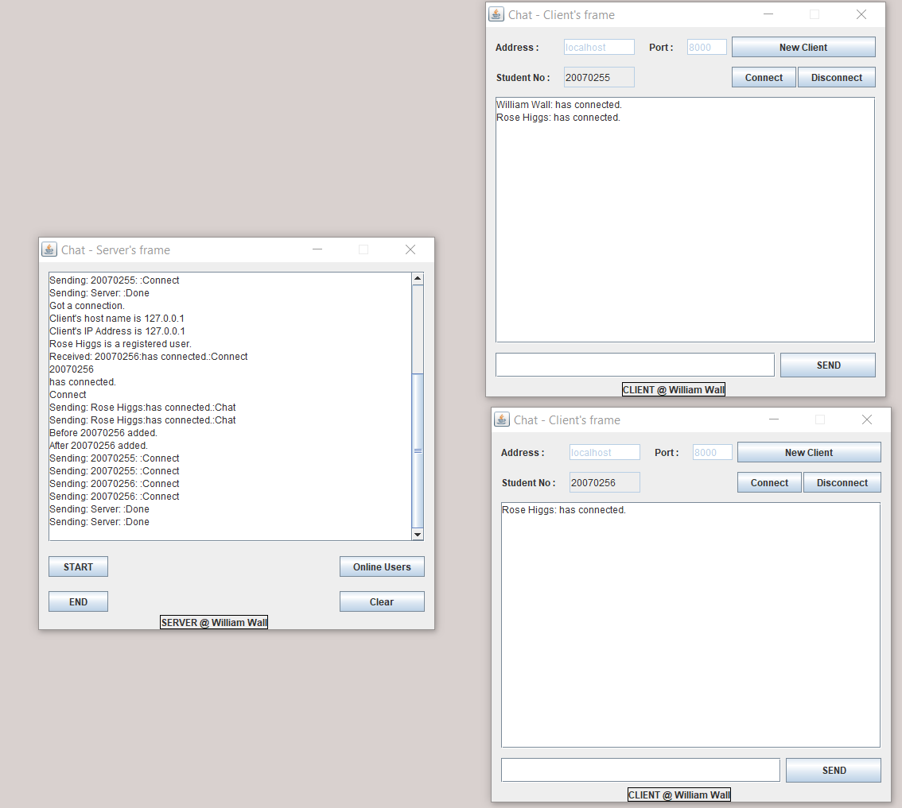

# Multithreaded Socket IO Client Server Chat App - Java, Swing, JDBC, MySQL, AWT, Sockets, Multithread, Authentication through SQL database, PHPmyAdmin 

## Client

* Login using registered student number through authentication with SQL database server backend.
* If user is registered, they can chat in real time to as many users logged into system.

## Server

* Handles all requests from the clients, messages, database, authentication etc ...
* Handles the database, checks if users are registered based oh what data the client sends, checks the client data in the sever hosted database and sends response to client based on findings of the server database.

## Tech used

* Sockets
* Multithread
* Authentication
* JDBC
* SWING/AWT
* MySQL
* phpMyAdmin
* io streams

